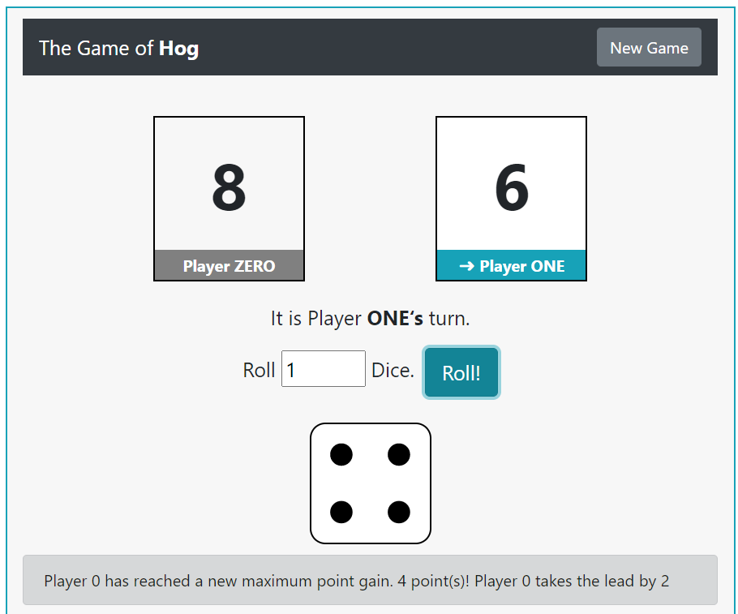

# Project 1: The Game of Hog

## Introduction
In this project, I've developed a simulator and multiple strategies for the dice game Hog, implementing a blend of control statements and higher-order functions. The game allows two players to alternate turns, aiming to be the first to reach or exceed 100 total points.



### Rules
- **Pig Out**: If any dice outcomes are 1, the current player's score for the turn is 1.
- **Free Bacon**: A player who chooses to roll zero dice scores points equal to ten minus the value of the opponent's score's ones digit, plus the tens digit.
- **Feral Hogs**: Rolling dice exactly 2 away from the previous turn's points gives 3 extra points.
- **Swine Swap**: Scores are swapped if the ones digit difference matches the opponent's tens digit.

## Getting Started
To play the game or contribute to its development, start by cloning this repository:

```bash
git clone https://github.com/psxyy18/hog.git
cd hog
```

Requirements
Ensure you have Python 3.x installed on your system. You can download it from python.org.

Running the Game
Execute the following command in the terminal:
```bash
python3 hog.py
```

For a more interactive experience, launch the graphical user interface:
```bash
python3 hog_gui.py
```
Development
This project is structured into multiple phases, each adding complexity and features to the game:

Phase 1: Simulator.
Phase 2: Commentary.
Phase 3: Strategies.

Acknowledgments
Special thanks to the CS61A staff and students for their ideas, testing, and feedback.
